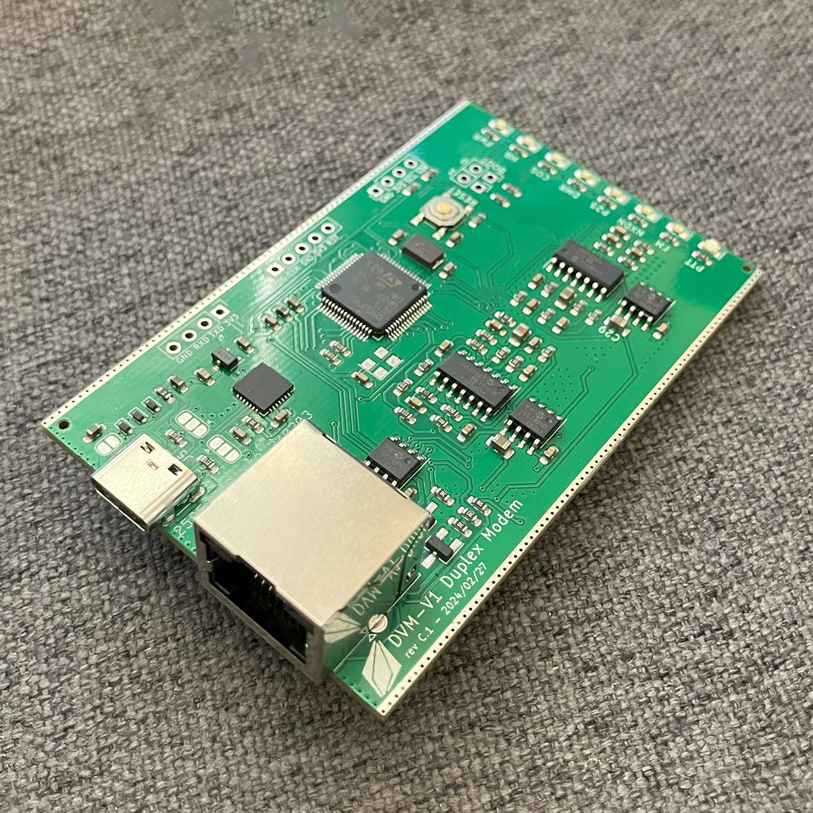
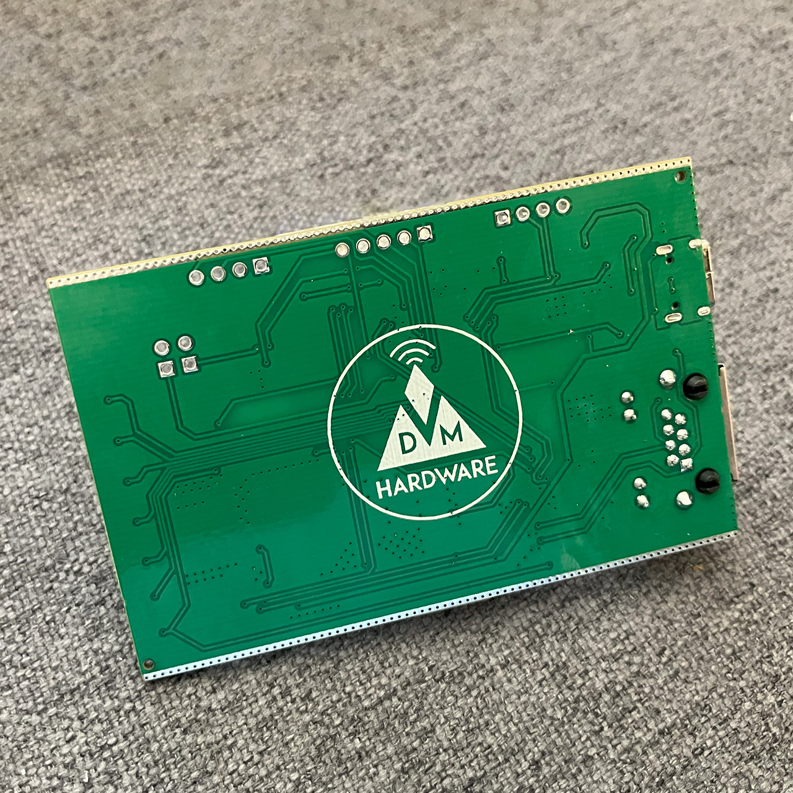
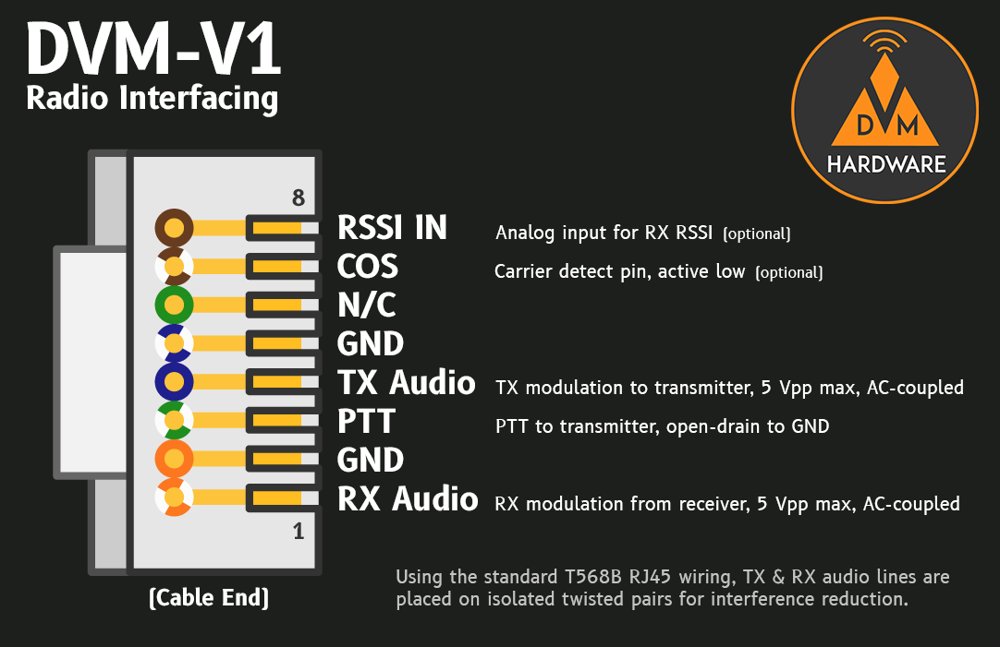

# DVM-V24 USB V24 Adapter
Bye-bye, trimpots. The official DVMProject duplex modem has 100% software calibration. Made for use with DVMHost and DVMFirmware, this modem allows you to turn any radio into a fully digital-capable base station.

## Hardware
DVM-V1 Modem boards are available from the [W3AXL Online Store](https://store.w3axl.com/products/dvm-v1-duplex-modem). Purchasing through W3AXL supports development efforts for the DVMProject team and future hardware projects!

[Schematics](https://github.com/DVMProject/dvmv1/blob/main/dvm-duplex-modem.pdf) and [an interactive BOM](https://htmlpreview.github.io/?https://github.com/DVMProject/dvmv1/blob/main/ibom.html) are available here for troubleshooting/debugging/experimenting. Have fun!

### Radio Interfaceing

See the below image for radio interfacing information via the RJ45.

